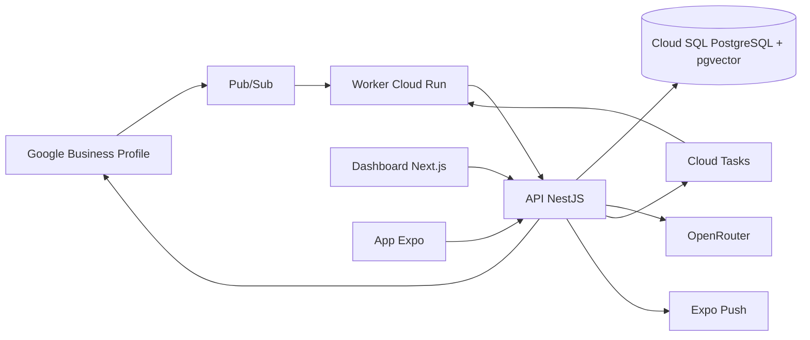
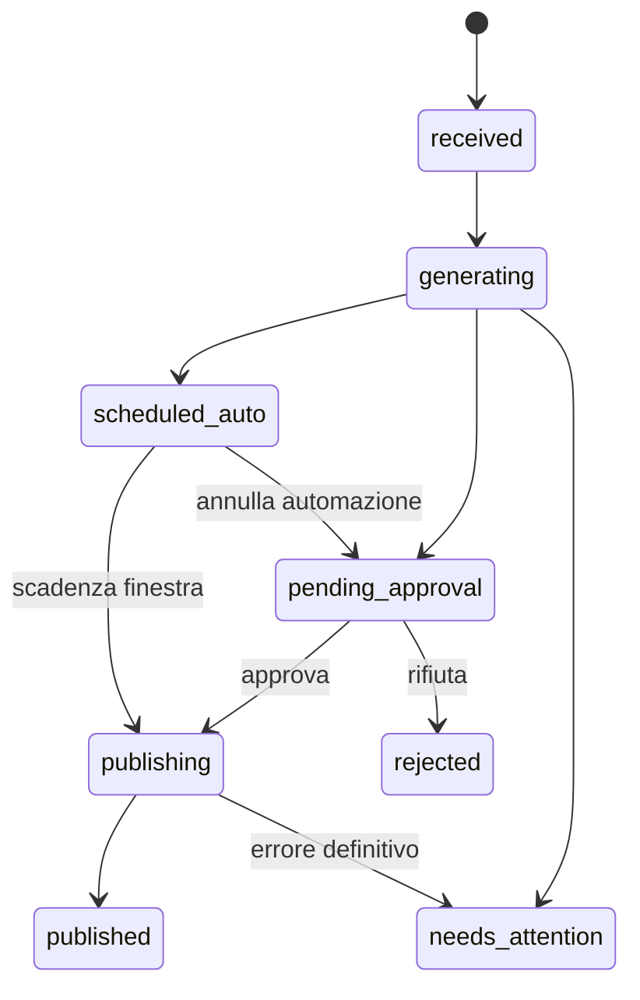

<div align="center">

# AutoReview

### Risposte AI alle recensioni Google, con una persona sempre al comando.

AutoReview raccoglie le recensioni di Google Business Profile, prepara risposte coerenti con la memoria aziendale e le sottopone ad approvazione prima della pubblicazione.

[](https://github.com/DevvoLazza/AutoReview/actions/workflows/ci.yml)
[](https://nodejs.org/)
[](https://nextjs.org/)
[](https://expo.dev/)
[](LICENSE)

**Pilot eseguibile · Multi-tenant by design · Automazione disattivata di default**

</div>

---

## Perché AutoReview

Rispondere bene alle recensioni richiede velocità, tono coerente e attenzione ai casi delicati. AutoReview automatizza la preparazione, non la responsabilità: il modello AI non possiede credenziali Google, non decide autonomamente se pubblicare e non può aggirare i controlli applicativi.

```text
Recensione Google
    → evento Pub/Sub
    → recupero della versione canonica
    → memoria aziendale approvata + AI
    → validazione e controlli di rischio
    → approvazione, modifica o invio programmato
    → pubblicazione su Google
    → verifica e audit
```

## Funzionalità

### Approvazione umana

- Inbox web e mobile con recensioni da gestire.
- Bozza AI nella lingua della recensione.
- Approva, modifica, rifiuta o richiedi una nuova versione.
- Istruzione libera del tipo “rendila più breve e cordiale”.
- Concorrenza ottimistica: due utenti non possono pubblicare due risposte diverse.
- Rilettura della recensione da Google immediatamente prima dell’invio.

### Memoria aziendale controllata

- Informazioni per azienda e singola sede.
- Tono di voce, lingue, servizi, orari, contatti e FAQ.
- Regole per reclami, rimborsi ed escalation.
- Fonti versionate con stato `draft`, `approved` o `retired`.
- Retrieval ibrido full-text e vettoriale con `pgvector`.
- Solo le fonti approvate possono influenzare una risposta.
- Le correzioni umane alimentano le valutazioni, ma non modificano automaticamente la memoria.

### Automazioni sicure

- Regole configurabili per sede, stelle, lingua, testo, categoria e ritardo.
- Almeno 20 revisioni manuali prima di abilitare l’automazione di una sede.
- Finestra predefinita di 10 minuti per annullare l’invio.
- Limiti giornalieri e kill switch globale.
- Hard stop non disattivabili per minacce legali, salute, discriminazione, frodi, rimborsi, chargeback, dati personali, accuse a dipendenti e linguaggio violento.

### Operatività

- Notifiche push prive del testo della recensione.
- Deep link verso una schermata autenticata; nessuna approvazione direttamente dalla notifica.
- Eventi e pubblicazioni idempotenti.
- Retry controllati, dead-letter queue e riconciliazione finale.
- Audit append-only di attore, decisione, modello, provider e versione della memoria.
- Eliminazione programmata dei contenuti Google temporanei entro 30 giorni.

## Architettura



| Area | Tecnologia | Responsabilità |
| --- | --- | --- |
| Dashboard | Next.js 16, React 19 | Inbox, memoria, regole, team e audit |
| Mobile | Expo 57, React Native 0.86 | Push, approvazione e modifica delle bozze |
| API | NestJS 12, Fastify 5 | Autenticazione, ruoli, workflow e OpenAPI |
| Worker | Node.js, Fastify | Pub/Sub, Cloud Tasks, retry e retention |
| Dominio | TypeScript, Zod | State machine, hard stop, contratti e validazione |
| Dati | PostgreSQL 17, Drizzle, pgvector | Multi-tenancy, RLS, memoria e audit |
| AI | OpenRouter, DeepSeek snapshot | Generazione strutturata senza tool o accesso ai dati |
| Cloud | Google Cloud, Terraform | Cloud Run, Cloud SQL, Pub/Sub, Tasks, KMS e Secret Manager |

Il modello configurato è uno snapshot immutabile (`deepseek/deepseek-v4-pro-0813`) con Structured Outputs, provider allowlist, `data_collection: "deny"` e ZDR. Il modello produce soltanto un `ReplyDraft`; la decisione di pubblicare appartiene sempre al motore deterministico.

## Stato del progetto

La repository contiene un **pilot end-to-end eseguibile con dati simulati** e adapter predisposti per i servizi reali.

| Capacità | Stato |
| --- | --- |
| Dashboard responsive | ✅ Implementata |
| App iOS/Android | ✅ Implementata, bundle verificati |
| Workflow approvazione e hard stop | ✅ Implementato e testato |
| Adapter Google reale e simulato | ✅ Implementato |
| Provider OpenRouter strutturato | ✅ Implementato |
| Schema PostgreSQL, RLS e migrazioni | ✅ Implementato |
| Terraform Google Cloud | ✅ Predisposto |
| Pilot su una sede Google reale | ⏳ Richiede approvazione e credenziali Google |
| Repository PostgreSQL nel runtime API | ⏳ Da collegare prima della produzione |
| Push su dispositivi fisici e release store | ⏳ Da verificare |
| Vendita SaaS multi-tenant | ⏳ Subordinata alla conferma scritta di Google |

> [!IMPORTANT]
> AutoReview non è ancora dichiarato production-ready. La modalità locale usa autenticazione, Google e AI simulati; nessuna risposta reale viene pubblicata durante lo sviluppo.

## Avvio rapido

### Requisiti

- Node.js 24 LTS
- pnpm 11
- Docker Desktop, se si vuole avviare PostgreSQL locale

### Installazione

```powershell
git clone https://github.com/DevvoLazza/AutoReview.git
Set-Location AutoReview
Copy-Item .env.example .env
pnpm install
pnpm dev
```

Servizi locali:

| Servizio | URL |
| --- | --- |
| Dashboard | `http://localhost:3000` |
| API | `http://localhost:4100/v1` |
| Swagger UI | `http://localhost:4100/docs` |
| OpenAPI JSON | `http://localhost:4100/openapi.json` |
| Worker | `http://localhost:4200` |

La dashboard e l’app mobile usano dati dimostrativi se l’API non è raggiungibile. Per simulare una nuova recensione:

```powershell
Invoke-RestMethod -Method Post `
  -Uri http://localhost:4100/v1/webhooks/google-business/demo
```

### PostgreSQL locale

```powershell
docker compose up -d postgres
pnpm db:migrate
```

## Configurazione

Le variabili sono documentate in [.env.example](.env.example). Le modalità predefinite sono intenzionalmente sicure:

```dotenv
AUTH_MODE=demo
AI_MODE=mock
GOOGLE_MODE=mock
TASKS_MODE=mock
```

Per un ambiente reale, credenziali e token devono provenire da Secret Manager. I refresh token Google devono essere cifrati con Cloud KMS prima della persistenza. Non inserire mai segreti nel repository.

## Workflow di una risposta



Ogni comando di modifica include `expectedVersion`. Una versione non aggiornata restituisce `409 version_conflict`. Prima della pubblicazione l’API recupera nuovamente la recensione canonica: se il testo è cambiato o esiste già una risposta, la bozza viene invalidata.

## Qualità e verifica

```powershell
pnpm lint
pnpm typecheck
pnpm test
pnpm build
pnpm audit --prod
```

La suite copre:

- transizioni della state machine e conflitti di versione;
- hard stop e regole automatiche;
- schema del `ReplyDraft` e configurazione OpenRouter;
- redelivery Pub/Sub e deduplica;
- API di generazione, approvazione e pubblicazione;
- bundle web, Android e iOS.

La CI esegue lint, typecheck, test, build e validazione Terraform con lockfile obbligatorio.

## Struttura della repository

```text
AutoReview/
├── apps/
│   ├── api/             API REST, OAuth e workflow
│   ├── worker/          Pub/Sub, Cloud Tasks e retention
│   ├── web/             dashboard Next.js
│   └── mobile/          app Expo iOS/Android
├── packages/
│   ├── contracts/       contratti Zod condivisi
│   ├── core/            dominio, AI, Google e regole
│   └── database/        Drizzle, PostgreSQL e pgvector
├── infra/terraform/     infrastruttura Google Cloud
├── docs/                architettura, API, sicurezza e go-live
└── .github/workflows/   pipeline CI
```

## Documentazione

- [Architettura e confini di fiducia](docs/architecture.md)
- [Contratti ed endpoint API](docs/api.md)
- [Sicurezza e privacy](docs/security.md)
- [Checklist di go-live Google](docs/go-live-google.md)

## Prima del pilot reale

1. Ottenere l’accesso alle Google Business Profile APIs.
2. Configurare OAuth, Identity Platform e MFA.
3. Collegare il runtime API al repository PostgreSQL transazionale.
4. Attivare la cifratura KMS dei refresh token.
5. Configurare OpenRouter e verificare provider, ZDR e localizzazione del trattamento.
6. Validare Terraform e migrazioni in un progetto GCP dedicato.
7. Provare Pub/Sub, push e pubblicazione con una singola sede e automazione spenta.
8. Eseguire test su dispositivi fisici prima di TestFlight o Play Internal Testing.

Google non offre un sandbox completo per Business Profile: l’adapter simulato rende affidabili sviluppo e CI, ma non sostituisce lo spike su una sede reale.

## Contribuire

La branch di sviluppo è `dev`; `main` rappresenta la release sincronizzata. Prima di proporre modifiche:

```powershell
pnpm lint
pnpm typecheck
pnpm test
pnpm build
```

Mantieni i commit piccoli, coerenti e verificabili. Non inserire token, file `.env`, dati reali delle recensioni o informazioni personali.

## Licenza

Distribuito con licenza [MIT](LICENSE). Copyright © 2026 Lazzaro Davide.
