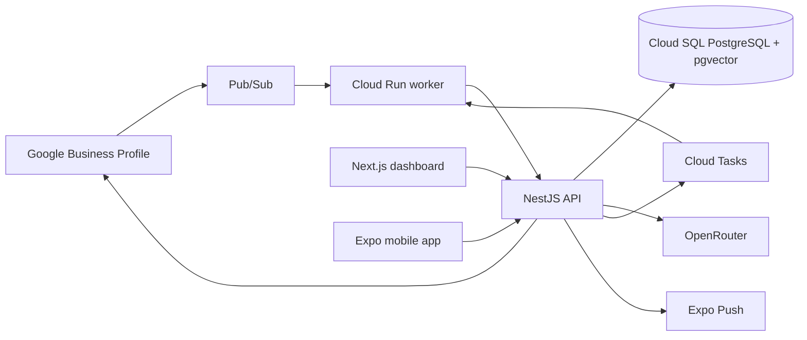
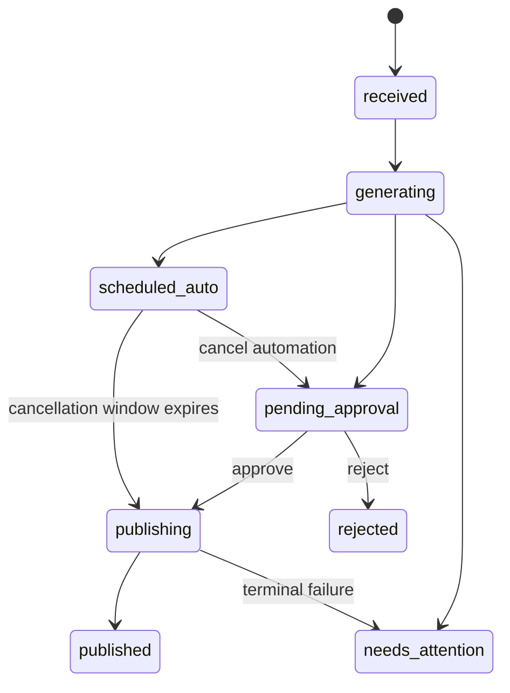

<div align="center">

# AutoReview

### Human-controlled AI responses for Google Business Profile reviews

AutoReview turns incoming reviews into grounded, brand-consistent reply drafts and routes every sensitive decision through a deterministic approval workflow.

[](https://github.com/DevvoLazza/AutoReview/actions/workflows/ci.yml)
[](https://nodejs.org/)
[](https://nextjs.org/)
[](https://expo.dev/)
[](LICENSE)

**Executable pilot · Multi-tenant by design · Automation disabled by default**

</div>

---

## Overview

Responding to customer reviews well requires speed, context, a consistent voice, and careful handling of sensitive situations. AutoReview automates preparation—not accountability.

The AI model can draft a response, identify risks, and cite the approved knowledge it used. It cannot access Google credentials, query the database directly, enable automation, or publish a response. Authorization and publication remain under application control.

```text
Google review
    → Pub/Sub event
    → canonical review retrieval
    → approved business knowledge + AI drafting
    → independent validation and risk controls
    → approval, revision, rejection, or scheduled delivery
    → Google publication
    → reconciliation and audit
```

## Product capabilities

### Human approval workflow

- Web and mobile inboxes for reviews requiring attention.
- Reply drafts generated in the language of the original review.
- Approve, edit, reject, or request a revised draft.
- Natural-language revision instructions such as “make it shorter and more empathetic.”
- Optimistic concurrency control prevents two users from publishing competing replies.
- The canonical Google review is retrieved again immediately before publication.

### Controlled business knowledge

- Tenant- and location-specific business profiles.
- Brand voice, supported languages, services, hours, contact details, and FAQs.
- Escalation rules for complaints, refunds, and sensitive topics.
- Versioned sources with `draft`, `approved`, and `retired` lifecycle states.
- Hybrid full-text and vector retrieval using PostgreSQL and `pgvector`.
- Only approved, currently valid sources may influence a reply.
- Human edits contribute to evaluation data; they never modify knowledge automatically.

### Guarded automation

- Rules scoped by location, rating, language, review text, category, and delay.
- A minimum of 20 manual reviews before a location becomes eligible for automation.
- A default 10-minute cancellation window before scheduled publication.
- Daily publication limits and a global kill switch.
- Non-bypassable hard stops for legal threats, health incidents, discrimination, fraud, refunds, chargebacks, personal data, employee allegations, and violent language.

### Operations and accountability

- Push notifications never contain review text.
- Notifications deep-link to an authenticated screen; approval never happens inside the notification.
- Idempotent event processing and publication attempts.
- Controlled retries, dead-letter handling, and final-state reconciliation.
- Append-only audit records for actor, decision, model, provider, prompt version, and knowledge version.
- Scheduled removal of temporary Google content within the required retention window.

## Architecture



| Layer | Technology | Responsibility |
| --- | --- | --- |
| Dashboard | Next.js 16, React 19 | Inbox, knowledge, rules, team, and audit |
| Mobile | Expo 57, React Native 0.86 | Push-driven review and approval workflow |
| API | NestJS 12, Fastify 5 | Authentication, authorization, workflow, and OpenAPI |
| Worker | Node.js, Fastify | Pub/Sub ingestion, Cloud Tasks, retries, and retention |
| Domain | TypeScript, Zod | State machine, hard stops, contracts, and validation |
| Data | PostgreSQL 17, Drizzle, pgvector | Tenant isolation, knowledge retrieval, and audit |
| AI | OpenRouter, pinned DeepSeek snapshot | Structured drafting without tools or data access |
| Infrastructure | Google Cloud, Terraform | Cloud Run, Cloud SQL, Pub/Sub, Tasks, KMS, and secrets |

The configured model is the immutable `deepseek/deepseek-v4-pro-0813` snapshot. Requests use Structured Outputs, a provider allowlist, `data_collection: "deny"`, and Zero Data Retention routing. The model returns a structured `ReplyDraft`; the deterministic policy engine alone decides whether the workflow may proceed.

## Review lifecycle



Every mutation includes an `expectedVersion`. Stale commands return `409 version_conflict`. Before publication, the API retrieves the canonical review again. If the review changed or already has a reply, the draft is invalidated and returned for reassessment.

## Project maturity

This repository contains an **end-to-end pilot that runs with simulated data**, plus adapters and infrastructure boundaries for real services.

| Capability | Status |
| --- | --- |
| Responsive operations dashboard | Implemented |
| iOS and Android companion app | Implemented; platform bundles verified |
| Approval workflow and hard stops | Implemented and tested |
| Real and simulated Google adapters | Implemented |
| Structured OpenRouter provider | Implemented |
| PostgreSQL schema, RLS, and migrations | Implemented |
| Google Cloud Terraform stack | Implemented and validated |
| Pilot against a real Google location | External Google approval and credentials required |
| PostgreSQL-backed API repository | Required before production |
| Physical-device push and store releases | Verification required |
| Commercial multi-tenant SaaS operation | Written Google confirmation required |

> [!IMPORTANT]
> AutoReview is not currently represented as production-ready. Local development uses simulated authentication, Google, AI, and scheduling by default. No real review is published in the development workflow.

## Quick start

### Requirements

- Node.js 24 LTS
- pnpm 11
- Docker Desktop, when running PostgreSQL locally

### Installation

```powershell
git clone https://github.com/DevvoLazza/AutoReview.git
Set-Location AutoReview
Copy-Item .env.example .env
pnpm install
pnpm dev
```

Local services:

| Service | URL |
| --- | --- |
| Dashboard | `http://localhost:3000` |
| API | `http://localhost:4100/v1` |
| Swagger UI | `http://localhost:4100/docs` |
| OpenAPI document | `http://localhost:4100/openapi.json` |
| Worker | `http://localhost:4200` |

The dashboard and mobile app fall back to demonstration data when the API is unavailable. To simulate a new review while the API is running:

```powershell
Invoke-RestMethod -Method Post `
  -Uri http://localhost:4100/v1/webhooks/google-business/demo
```

### Local PostgreSQL

```powershell
docker compose up -d postgres
pnpm db:migrate
```

## Configuration

Available environment variables are documented in [.env.example](.env.example). Safe local defaults are explicit:

```dotenv
AUTH_MODE=demo
AI_MODE=mock
GOOGLE_MODE=mock
TASKS_MODE=mock
```

Production credentials must be supplied through Secret Manager. Google refresh tokens must be encrypted with Cloud KMS before persistence. Never commit credentials, tokens, `.env` files, or real review data.

## Verification

```powershell
pnpm lint
pnpm typecheck
pnpm test
pnpm build
pnpm audit --prod
```

The automated suite covers:

- state-machine transitions and version conflicts;
- hard stops and automation eligibility;
- `ReplyDraft` validation and OpenRouter request controls;
- Pub/Sub redelivery and event deduplication;
- draft generation, approval, and publication API behavior;
- web, Android, and iOS bundles.

GitHub Actions runs linting, type checking, tests, production builds, and Terraform formatting and validation with a required lockfile.

## Repository structure

```text
AutoReview/
├── apps/
│   ├── api/             REST API, OAuth, authorization, and workflow
│   ├── worker/          Pub/Sub, Cloud Tasks, retries, and retention
│   ├── web/             Next.js operations dashboard
│   └── mobile/          Expo iOS and Android app
├── packages/
│   ├── contracts/       shared Zod contracts
│   ├── core/            domain, AI, Google, and policy engine
│   └── database/        Drizzle, PostgreSQL, RLS, and pgvector
├── infra/terraform/     Google Cloud infrastructure
├── docs/                architecture, API, security, and go-live guidance
└── .github/workflows/   continuous integration
```

## Documentation

- [Architecture and trust boundaries](docs/architecture.md)
- [API endpoints and contracts](docs/api.md)
- [Engineering security model](docs/security.md)
- [Security policy and vulnerability reporting](SECURITY.md)
- [Google go-live checklist](docs/go-live-google.md)

## Production readiness checklist

1. Obtain access to the Google Business Profile APIs.
2. Configure OAuth, Identity Platform, and enforced MFA.
3. Replace the in-memory API store with the transactional PostgreSQL repository.
4. Enable KMS encryption for Google refresh tokens.
5. Configure OpenRouter and verify provider, ZDR, and processing-location requirements.
6. Apply migrations and Terraform in a dedicated Google Cloud project.
7. Exercise Pub/Sub, push delivery, OAuth revocation, and publication against one real location with automation disabled.
8. Complete physical-device testing before TestFlight or Play Internal Testing.
9. Complete privacy, DPA/SCC, incident-response, backup-restore, and store-listing work.

Google Business Profile does not provide a complete sandbox. The simulated adapter makes local development and CI deterministic, but it does not replace the controlled real-location pilot.

## Contributing

Development happens on `dev`; `main` represents the synchronized release branch. Before proposing a change, run:

```powershell
pnpm lint
pnpm typecheck
pnpm test
pnpm build
```

Keep commits focused, reviewable, and independently meaningful. Do not commit secrets, `.env` files, personal data, or production review content.

## License

Licensed under the [MIT License](LICENSE). Copyright © 2026 Lazzaro Davide.
