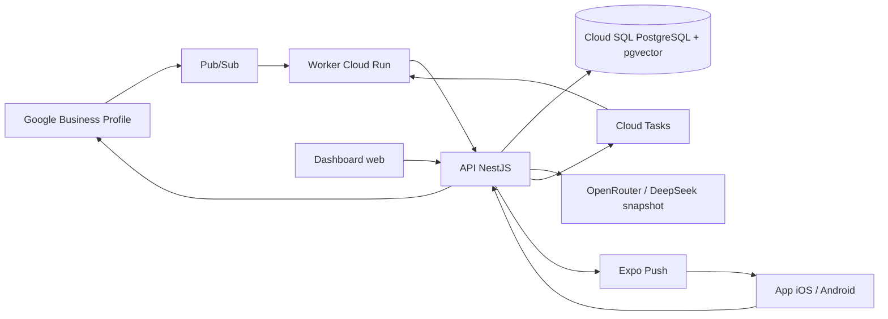

# Architettura



## Confini di fiducia

1. Pub/Sub e Cloud Tasks chiamano soltanto il worker e presentano un token OIDC di un service account dedicato.
2. Il worker valida l'identità e inoltra all'API con un segreto interno ruotabile.
3. Identity Platform autentica web e mobile. I claim contengono tenant, utente, ruolo e stato MFA.
4. L'API applica il `tenant_id` a ogni accesso. In PostgreSQL la RLS è una seconda barriera.
5. Il modello riceve recensione e un piccolo insieme di fonti approvate, non credenziali, tool o accesso al database.
6. La pubblicazione è l'unica operazione che scrive su Google e rilegge sempre la recensione canonica prima dell'invio.

## Stato e concorrenza

Ogni comando porta `expectedVersion`. Una modifica concorrente genera `409 version_conflict`; nessuna seconda approvazione può riusare una versione consumata.

```text
received -> generating -> pending_approval -> publishing -> published
                     \-> scheduled_auto ----/
                     \-> needs_attention
pending_approval -> rejected
```

Le richieste Pub/Sub hanno `messageId` univoco. Gli invii persistono una chiave di idempotenza e Cloud Tasks ritenta solo errori transitivi. La DLQ conserva gli eventi esauriti per l'intervento operativo.

## Memoria

Le fonti hanno versione, stato, autore e validità temporale. Solo `approved` entra nel retrieval. Il database prevede chunk, indice full-text e vettori; l'approvatore vede gli identificativi delle fonti usate. Correzioni umane alimentano eval e proposte, mai una modifica automatica della memoria.

## Retention

`review_cases.content_expires_at` viene impostato entro 30 giorni dalla ricezione. Il task periodico rimuove nome, commento e replica Google, mantenendo solo audit non riconducibile e metadati operativi necessari. Il job va schedulato almeno giornalmente e monitorato.
