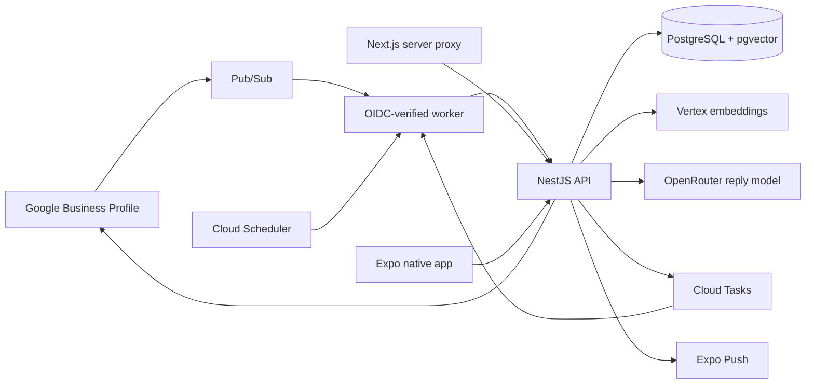

# Architecture

AutoReview separates drafting from authorization and publication. Shared interfaces allow live and simulated Google/AI adapters without placing credentials or tools in model context.

## Runtime ownership

The pilot's authoritative aggregates are `runtime_records`: review, knowledge, rule, location, settings, counters, encrypted Google connection, device registration, OAuth nonce, event lease, publication intent, and metadata audit. `runtime_knowledge_chunks` stores versioned text chunks and vectors. Earlier normalized tables are reserved for future reporting and are not the API's active persistence path.

Every repository operation starts a short transaction and sets `app.tenant_id` with a parameterized, transaction-local statement. Both runtime tables force RLS; reads and writes retain explicit tenant predicates. The runtime login is separate from the migration/table-owner role. Pool size and query timeouts are bounded.

Review mutations compare both domain and repository versions. Entering `publishing` and saving the desired reply intent is one atomic batch. An append-only database trigger protects runtime audit entries.

## Event and publication recovery

1. Worker verifies Google's OIDC issuer, audience, verified service-account email and IAM invocation.
2. API verifies the internal credential, resolves the authorized location, and claims a durable Pub/Sub message lease.
3. Completed redeliveries are acknowledged; in-flight processing returns a retryable error rather than falsely acknowledging unfinished work.
4. Canonical review retrieval and source-aware generation create a versioned draft.
5. Publication rereads Google, invalidates changed/answered reviews, writes once, then verifies the canonical reply.
6. A lost/unconfirmed response remains `publishing`. After two minutes, reconciliation uses GET only. Matching reply confirms success; an unchanged review without a reply returns to approval; changed/foreign replies require reassessment.

Google has no application-supplied transactional idempotency key for reply PUT. Safety comes from durable intent, atomic transitions, canonical revalidation and avoiding blind PUT retries—not from a nonexistent Google idempotency API.

## Knowledge and AI

Documents are extracted in a bounded child process; original binaries are not archived. Sources are drafts until explicitly approved. Approval indexes paragraph/section chunks with 768-dimensional Vertex embeddings and atomically approves a new source version. Retrieval joins the current approved source version, checks dates and location, and combines full-text with cosine similarity. Policy/forbidden-claim sources receive priority.

The production embedding adapter uses a configured Vertex model/region; the demo uses an explicitly labeled keyword retriever. A source supports at most 48 indexed chunks per approval; split larger sources. Changing embedding models requires source reindexing. Sources used by a draft remain visible internally, and retirement/version changes invalidate affected drafts before publication.

The pinned reply model returns JSON Schema-constrained output. A separate request validates the draft. Deterministic risk checks and automation rules operate outside the model. No automatic learning or correction-dataset pipeline is shipped; human changes never update approved knowledge implicitly.

## Clients and notifications

Web calls a same-origin server proxy. Encrypted HttpOnly cookies hold identity sessions; secrets stay outside the browser bundle. Native credentials use SecureStore and refreshed Identity tokens. Deep links open authenticated UUID routes, never approve directly.

Push submission uses a persisted content-free outbox, bounded exponential retries and invalid-token removal. Scheduler retries pending submissions every five minutes. Accepted Expo tickets do not prove physical delivery; receipt-level delivery analytics remain future work. Partial acceptance can yield duplicate notifications on retry, but cannot duplicate Google publication. The inbox is the source of truth.

## Pilot boundary

Production accepts one configured workspace; storage isolation is independently tested across tenants. Commercial SaaS enrollment, billing, self-service team management, original document storage, correction datasets, full OpenTelemetry instrumentation and receipt-level push monitoring are not part of this pilot. Expansion requires product work plus Google and privacy approvals.
