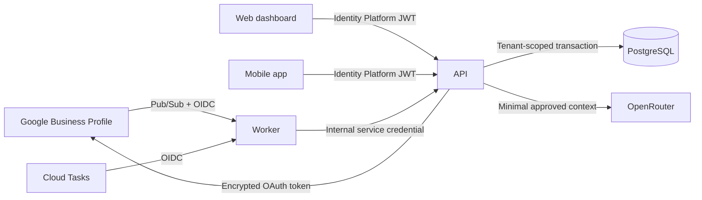

# Engineering security model

This document describes the security properties AutoReview is designed to preserve, the controls currently represented in the codebase, and the gates that remain before a production deployment. Vulnerability reporting instructions are available in the repository-level [Security Policy](../SECURITY.md).

## Security objectives

AutoReview must preserve the following invariants:

1. A tenant cannot read, infer, or modify another tenant’s data.
2. A reply cannot be published without a valid human approval or an active, eligible automation rule.
3. Hard-stop conditions cannot be bypassed by a prompt, model output, tenant configuration, or application role.
4. The AI provider never receives Google credentials, database access, publication tools, or arbitrary network capabilities.
5. Technical logs do not contain review text, prompts, generated replies, OAuth tokens, or personal data.
6. Temporary Google content is removed within the applicable retention window.
7. Every material decision is attributable to an actor, record version, policy version, model, provider endpoint, and knowledge snapshot.
8. Duplicate events, retries, and concurrent approvals cannot produce duplicate Google replies.

## Trust boundaries



- Google Pub/Sub and Cloud Tasks may invoke only the worker identity.
- The worker validates the Google-issued OIDC token before forwarding a normalized event.
- The API authenticates users through Identity Platform and authorizes every command by tenant, location, role, and MFA state.
- PostgreSQL row-level security is a second tenant-isolation boundary, not a replacement for application authorization.
- The AI provider receives only the review and the smallest relevant set of approved knowledge sources.
- Google publication is a narrowly scoped operation performed only after canonical revalidation.

## Threat model

| Threat | Primary controls |
| --- | --- |
| Cross-tenant access | Mandatory `tenant_id`, role checks, PostgreSQL RLS, isolation tests |
| Duplicate publication | Event deduplication, optimistic locking, idempotency keys, canonical reread |
| Unauthorized automation | Owner-only enablement, MFA, versioned consent, calibration threshold, kill switch |
| Prompt injection in a review or document | Untrusted-content delimiters, no model tools, structured output, deterministic validation |
| Unsupported or fabricated claims | Approved-source retrieval, source identifiers, unsupported-claim detection, human review |
| Sensitive-case automation | Non-bypassable hard stops and mandatory escalation |
| Stolen Google refresh token | Secret Manager, KMS encryption, restricted service accounts, immediate revocation path |
| Forged worker invocation | Google OIDC validation, audience verification, internal service credential |
| Replay or concurrent commands | Record versions, atomic transitions, processed-event registry |
| Sensitive-data leakage through logs | Structured metadata-only logging and explicit prohibited fields |
| Dependency or CI compromise | Frozen lockfiles, lifecycle-script allowlist, dependency audit, pinned CI actions |
| Data retained beyond policy | Expiry timestamp, scheduled purge, operational alerting, disconnect workflow |

## Authentication and authorization

### User sessions

Production requests require an Identity Platform JWT. The API validates issuer, audience, signature, expiry, tenant claim, user identity, role, and MFA state. Demo authentication is accepted only outside production.

The role model is intentionally small:

- `Owner`: tenant configuration, team management, consent, automation, and integrations.
- `Admin`: operational configuration without ownership transfer.
- `Editor`: draft creation and editing.
- `Approver`: approval, rejection, and scheduled-publication cancellation.

Owner and Approver actions require MFA. Enabling an automation rule additionally requires an Owner, a current MFA claim, versioned consent, and the location calibration threshold.

### Service-to-service calls

- Pub/Sub and Cloud Tasks use a dedicated push service account.
- The worker validates Google OIDC issuer, signature, audience, and service-account identity.
- Worker-to-API requests use a separate rotatable internal credential.
- Service accounts follow least privilege and are not shared between API, worker, and push delivery.

## Tenant isolation

Every tenant-owned record carries `tenant_id`. Application queries must include the authenticated tenant even when the caller supplies a globally unique identifier.

PostgreSQL RLS policies use a transaction-local tenant context. Production repository operations must:

1. start a transaction;
2. set the tenant context using a parameterized statement;
3. execute all reads and writes within that transaction;
4. clear the context automatically when the transaction ends.

The schema also uses tenant-aware indexes and foreign keys where appropriate. Cross-tenant integration tests remain a release gate for the PostgreSQL-backed runtime repository.

## AI and knowledge security

The model is treated as an untrusted drafting component.

- It receives no tools, credentials, database client, HTTP client, or publication capability.
- Reviews and uploaded documents are marked as untrusted content, not instructions.
- Only approved and currently valid knowledge chunks are eligible for retrieval.
- Output must satisfy the `ReplyDraft` JSON Schema.
- A second validation pass checks language, tone, unsupported claims, source coverage, and risk flags.
- The deterministic hard-stop engine runs independently of the model’s classification.
- The automation engine consumes validated fields; the model never chooses whether to publish.
- Human corrections may produce evaluation examples or proposed style rules, but cannot mutate approved knowledge automatically.

OpenRouter requests use a pinned model snapshot, an explicit provider allowlist, `data_collection: "deny"`, Zero Data Retention routing, and required-parameter enforcement. The selected provider endpoint is recorded in the audit trail without storing prompt content in technical logs.

## Google integration security

- OAuth authorization uses a signed, short-lived state value.
- Offline access is requested only after explicit business-owner initiation.
- Refresh tokens must be encrypted with Cloud KMS before database persistence.
- Tokens are never returned to web or mobile clients.
- Before publication, the API retrieves the canonical review again.
- A changed review, an existing reply, revoked authorization, or a location mismatch moves the case to a safe attention state.
- Disconnecting a location revokes authorization, removes notification configuration, cancels pending work, and schedules temporary-content deletion.

The first production pilot must use one explicitly authorized location with automation disabled.

## Workflow integrity

Review state changes are explicit and versioned:

```text
received → generating → pending_approval | scheduled_auto
         → publishing → published
         ↘ rejected | needs_attention
```

Every user command includes `expectedVersion`. Publication uses an idempotency key tied to the review, draft, and version. Pub/Sub message IDs are recorded before processing, and retries are limited to transient failures. Exhausted events move to a dead-letter queue for operator review.

No API route can move directly from `received` to `published`, and no model response can perform a state transition by itself.

## Data protection and retention

### Data minimization

- Push payloads contain identifiers only, never review text.
- AI requests contain the review and only the knowledge required for that response.
- Technical logs contain operational metadata rather than business content.
- Documents remain private and are accessed through service identities.

### Retention

Google-derived review snapshots receive a `content_expires_at` value no later than 30 days after collection. A scheduled purge removes reviewer name, review text, reply text, and other temporary Google content. Minimal non-content audit metadata may be retained when required for security and operational accountability.

The purge job must run at least daily and alert when it is delayed, failing, or unable to delete eligible data.

### Encryption

- TLS is required for all external and service-to-service traffic.
- Cloud SQL, Cloud Storage, backups, and Secret Manager use encryption at rest.
- Google refresh tokens use an application-controlled KMS key with rotation and narrowly scoped decrypt permission.
- Backup and point-in-time recovery settings are represented in Terraform and require restore testing before production.

## Secrets and configuration

- Production secrets belong in Secret Manager and are mounted as runtime environment values.
- `.env` files, tokens, credentials, and production review data must never enter version control.
- Secret access is restricted to the service account that requires it.
- OAuth state secrets, worker credentials, API keys, and database credentials must be independently rotatable.
- Configuration changes affecting automation or consent require an authenticated actor and an audit event.

## Logging, monitoring, and audit

Technical logs must exclude:

- review text and reviewer identity;
- prompt and generated-reply content;
- OAuth access and refresh tokens;
- authorization headers, cookies, API keys, and document contents.

Operational metrics should cover Pub/Sub backlog, dead-letter volume, OAuth revocation, draft-generation failures, scheduled-task delay, publication failures, purge delay, and unusual cross-tenant authorization failures.

Audit events are append-only. They record the actor, tenant, action, target, record version, policy result, model snapshot, provider endpoint, prompt version, and knowledge-source identifiers. Audit records must not duplicate the sensitive content they describe.

## Controls represented in this repository

- Structured AI input and output validation.
- Deterministic hard stops for sensitive categories and prompt-injection indicators.
- Pinned model snapshot, ZDR routing, provider allowlist, and data-collection denial.
- Signed and expiring OAuth state.
- Identity Platform JWT validation, role checks, and MFA gates.
- Google OIDC validation on worker entry points.
- Optimistic locking, event deduplication, idempotent publication, and canonical rereads.
- PostgreSQL schema with RLS policies, full-text search, and vector indexes.
- Append-only audit protections.
- Private Cloud SQL networking, Secret Manager, KMS, encrypted backups, and PITR configuration.
- Frozen dependency and Terraform provider lockfiles with continuous integration checks.

## Production security gates

The following work remains mandatory before production:

- replace the in-memory API store with the transactional PostgreSQL repository;
- run tenant-isolation tests against a real PostgreSQL instance with RLS enabled;
- integrate and verify KMS encryption and decryption for Google refresh tokens;
- enforce MFA in Identity Platform and test claim revocation and session expiry;
- verify OAuth revocation, location disconnect, and notification removal end to end;
- complete DAST, dependency review, backup restoration, and incident-response exercises;
- verify OpenRouter provider eligibility, ZDR behavior, DPA/SCC terms, and regional processing requirements;
- configure production alerting, dead-letter runbooks, secret rotation, and purge monitoring;
- perform physical-device push testing without sensitive notification content;
- complete privacy review, DPIA where applicable, and Google policy approval for the operating model.

Until these gates are complete, the repository should be treated as a security-conscious pilot—not as evidence of production certification or regulatory compliance.
